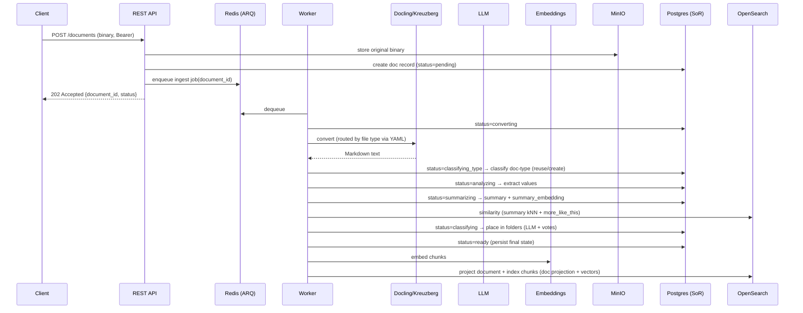

# Architecture

> Status: Draft v1 · Project: **Saga**
>
> This document describes **how** the functional/non-functional requirements are
> realised. Decisions confirmed with the project owner are marked **[Decision]**.

---

## 1. High-level overview

**Postgres is the system of record**; OpenSearch is a rebuildable search projection
derived from it. MinIO holds original binaries; Redis + ARQ drive async ingestion.

```mermaid
flowchart LR
    client[API client] -->|Bearer| api[REST API (FastAPI)]
    agent[RAG agent] -->|Bearer / MCP HTTP| mcp[MCP Server]

    api -->|enqueue job| redis[(Redis)]
    worker[Worker (ARQ)] -->|dequeue| redis

    worker -->|convert| docling[Docling service]
    worker -->|convert| kreuzberg[Kreuzberg service]
    worker -->|analyse| llm[(LLM provider\nOllama/OpenAI/Azure)]
    worker -->|embed| emb[(Embedding provider)]

    api --> pg[(Postgres\nsystem of record)]
    worker --> pg
    mcp --> pg

    api --> minio[(MinIO)]
    worker --> minio
    worker -->|project| os[(OpenSearch\ndoc projection + vector index)]

    api --> os
    mcp --> os
    mcp --> emb
```

### Components

| Component | Tech | Responsibility |
|-----------|------|----------------|
| **REST API** | FastAPI + Uvicorn | Document/folder/doc-type/note CRUD, status, search, folder-tree browsing, backup export, Swagger UI. |
| **MCP server** | Python MCP SDK (Streamable HTTP) **[Decision]** | Read tools (search + browsing) **and** write tools (organise documents/folders/doc-types/notes) for agents. Separate container. |
| **Worker** | ARQ + Redis **[Decision]** | Durable async pipeline: convert → classify type → extract → summarise → similarity → place → persist → project + index. |
| **Docling service** | Official `docling-serve` container | Converts PDFs (default) to Markdown, incl. OCR/layout. |
| **Kreuzberg service** | Official Kreuzberg API container | Converts all non-PDF formats + image/scanned OCR to text/Markdown. |
| **Postgres** | PostgreSQL (async, SQLAlchemy/asyncpg) | **System of record**: documents, doc-types, folders, memberships, notes. |
| **OpenSearch** | OpenSearch + Dashboards | Rebuildable projection: document index (keyword + summary vector) + chunk vector index (kNN). |
| **MinIO** | MinIO | Binary object storage for originals. |
| **Redis** | Redis | ARQ job queue + result/status backend. |
| **LLM/Embeddings** | Ollama (default) / OpenAI / Azure **[Decision]** | Doc-type classification, value extraction, summary, folder placement, embeddings. |

---

## 2. Ingestion pipeline

The pipeline order (see `pipeline/tasks.py` and `pipeline/stages.py`):
**convert → classify doc-type → extract values → summarise (+embed) → compute
similarity → place in folder(s) → persist → project + index chunks → ready.** Each
stage advances the document status (FR-12) and stores an actionable error on failure.



### Converter routing **[Decision: PDF→Docling, else→Kreuzberg]**
Routing is a YAML map of MIME type / extension → service. Resolution order:
explicit extension → MIME type → fallback (`default`). See `config/converters.yaml`.

### Chunking
1. **Markdown-aware splitter** preserves heading/section boundaries.
2. If a resulting chunk exceeds `chunking.max_tokens`, apply **token-based splitting**
   with configurable overlap.
3. `chunking.max_tokens` (and overlap) are **configurable**.

---

### 3.1 Postgres — system of record (FR-40)
All metadata is authoritatively stored in Postgres. The core entities:

| Entity | Key fields | Notes |
|--------|-----------|-------|
| `documents` | `document_id`, `title`, `mime_type`, `size_bytes`, `content_hash`, `minio_object`, `status`, `error`, `content_markdown`, `doc_type_id`, `summary`, `summary_embedding`, `extracted_values`, timestamps | One row per document; the source for all reads. |
| `doc_types` | `doc_type_id`, `name`, `description`, `document_count`, timestamps | First-class type (FR-14); **exactly one per document** (1:1). |
| `folders` | `folder_id`, `name`, `description`, `parent_id`, `metadata`, timestamps | Hierarchical (FR-16); `description`/`metadata` are LLM context. |
| `memberships` | `document_id`, `folder_id`, `is_primary`, `assigned_by` | Document↔folder **n:m**; at most one `is_primary` per document (FR-17). |
| `notes` | `note_id`, parent (document **or** folder), `content`, timestamps | Notes attach to documents and folders (FR-39). |

`summary_embedding` is stored in Postgres and used for ingestion-time similarity.
A document's `primary_folder_id` is derived from its memberships (the one flagged
`is_primary`, else the first).

### 3.2 OpenSearch — search projection (FR-25)
OpenSearch is a **rebuildable** projection of Postgres, not authoritative.

#### Document index (`documents`)
Keyword/metadata-optimised, kNN-enabled for the summary vector. One record per document.

| Field | Type | Notes |
|-------|------|-------|
| `document_id` | keyword | reference back to Postgres. |
| `title` | text + keyword | filename / derived title. |
| `summary` | text | LLM summary (BM25 field, FR-38). |
| `content_markdown` | text | full converted Markdown (BM25 keyword search). |
| `doc_type` | keyword | doc-type name (FR-14). |
| `extracted_values` | nested | `{key, type, value, normalized, confidence}` (FR-15). |
| `folder_ids` | keyword[] | direct folder memberships (FR-16). |
| `folder_ancestor_ids` | keyword[] | memberships **and their ancestors** → single-term subtree filter. |
| `primary_folder_id` | keyword | canonical folder (FR-17). |
| `value_terms` | keyword[] | denormalised `key=value` terms for filtering. |
| `summary_embedding` | knn_vector(dim) | document-level similarity at ingestion (FR-16). |
| `minio_object`, `content_hash` | keyword | original binary key; dedup (FR-13). |
| `mime_type`, `size_bytes` | keyword/long | |
| `status` | keyword | pending/…/ready/failed (search status filters read the projection). |
| `created_at`, `updated_at` | date | |

#### Vector index (`document_chunks`)
kNN-enabled. One record per chunk.

| Field | Type | Notes |
|-------|------|-------|
| `chunk_id` | keyword | `${document_id}:${ordinal}`. |
| `document_id` | keyword | **reference** to the document (FR-25). |
| `snippet` | text | chunk text (returned in results). |
| `ordinal` | integer | position in document. |
| `embedding` | knn_vector(dim) | dimension matches active embedding model (FR-27). |
| `title`, `doc_type`, `folder_ids`, `folder_ancestor_ids`, `value_terms`, `status`, `created_at`, `mime_type`, `size_bytes` | keyword(/[]) etc. | denormalised so chunk search filters on the same fields as the document index. |

> **Note (NFR/risk):** the `knn_vector` dimension is fixed at index-creation time and
> must match the embedding model. Changing the embedding model requires a reindex.
> This is documented and handled via an index alias + reindex routine.

### 3.3 Referential integrity
Delete document → delete-by-query on `document_chunks` where `document_id` matches,
delete the document projection and MinIO object, and delete the Postgres row plus its
memberships/notes (FR-26). Because OpenSearch is derived, the projection can always be
rebuilt from Postgres + MinIO.

---

## 4. Fused hybrid search (RRF)

Search merges a **keyword** ranking and a **semantic** ranking into a **single ranked
document list** using **Reciprocal Rank Fusion** (`SearchService.hybrid_search`):

1. **Keyword** — a `query_string` over the document projection (configurable
   `keyword_search_fields`, default `title^3, summary^2, content_markdown, doc_type`),
   with metadata filters. Produces a document ranking.
2. **Semantic** — the query is embedded (warm session) and run as kNN over the chunk
   index, then rolled up to the best chunk per parent document. Produces a document
   ranking.
3. **Fusion** — each ranking contributes `1/(k + rank)` per document
   (`k = opensearch.rrf_k`, default 60); documents are sorted by the summed score and
   the top `top_k` are hydrated from Postgres, each with its best matching snippet.

At least one of `keyword_query` / `semantic_query` must be provided; both share the
same filters (doc-type, `folder_id` + `include_subtree`, title, status, created-at
range, extracted values). There is **no longer** a separate keyword/semantic result
pair — callers get one fused list (`results: [SearchResultItem...]`).

Performance levers (NFR-10/12): warm models, pooled clients, denormalised filter
fields, bounded `top_k`.

---

## 5. Folders & placement

Folders are **first-class, hierarchical entities in Postgres** (FR-16), replacing the
old derived "category paths". The **folder tree** is built from Postgres (`parent_id`
links) with subtree document counts and exposed by both REST (`GET /folders`,
`GET /folders/{id}/documents`) and MCP (`get_folder_tree`, `list_documents_in_folder`).
A document may belong to **multiple folders** (n:m), with at most one `is_primary`
membership; the projection denormalises every membership **and its ancestors** into
`folder_ancestor_ids`, so a subtree filter is a single term match.

**Placement during ingestion (FR-16/17).** After the summary is embedded, the
`compute_similarity` stage finds the most similar existing documents — combining
semantic kNN over `summary_embedding`, lexical `more_like_this`, doc-type match, and
Jaccard over extracted values (weights in `config/config.yaml` → `similarity`). Their
folders are aggregated into **folder votes** (boosting each document's primary folder
and giving partial credit to ancestor folders). The `place_in_folder` stage then asks
the LLM to assign the document to 1..n folders, given the folder tree (with
descriptions/metadata), the likely-folder votes, the summary, and extracted values.
When `folder_placement.allow_auto_create` is set, the model may create new folders and
nominate a primary. If the LLM returns nothing, the top-voted folder is used as a
fallback.

---

## 6. LLM & embeddings abstraction

**Structured metadata extraction** (doc-type classification, value extraction,
summary, folder placement) is performed with the **`saidex`** structured-output library:
it drives a LangChain chat model via **tool-calling** to populate a Pydantic schema and
**retries on schema/type errors** by feeding the validation errors back to the model,
with an optional **fallback model** (FR-18). `saga.llm.providers` builds the chat
model (**Ollama** / **OpenAI** / **Azure OpenAI**) from YAML/env; the analyzer
(`saga.llm.analyzer`) calls `extract_from_text(model, Schema, text, system_prompt=…)`.
Each step is resilient — a step that still fails after all retries falls back to a
sensible default so the document remains searchable. The doc-type and folder-placement
steps are gated by `llm.doctype_classification` / `llm.folder_placement` config
(`allow_auto_create`, prompt-size limits).

**Embeddings** use a separate provider abstraction (`saga.embeddings`) with
Ollama/OpenAI/Azure adapters over the raw SDKs (no structured extraction involved).
Embeddings cover both the per-chunk vectors and the document `summary_embedding`.

Prompts (doc-type, value extraction, summary, folder placement) and MCP tool
descriptions are **external Markdown files** under `prompts/`, loaded + rendered at
runtime (NFR-30) — enabling review/versioning without code changes.

---

## 7. Backup/export

- `GET /export/documents` with cursor pagination streams all docs (FR-28). Each
  exported document includes a **`primary_folder_path`** (folder names root → primary)
  resolved from Postgres.
- `scripts/backup.py` pages through the API and writes, per document, into a
  directory derived from `primary_folder_path` (FR-30) — documents with no folder go
  under `_unfiled` — storing the original binary, the `.md` text, and a
  `*.metadata.json` sidecar (FR-31).

---

## 8. Security

- Bearer auth dependency on all REST routes (configurable token(s), constant-time
  compare); same for the MCP HTTP endpoint (NFR-18).
- Secrets via env/`.env`; `.env.example` documents them (NFR-19).
- Upload size/content-type validation; pagination caps (NFR-13/20).

---

## 9. Configuration layout

```
config/
  config.yaml        # app: api, mcp, security, opensearch, postgres, minio, redis, chunking, dedup, similarity
  converters.yaml    # file-type -> converter routing (+ service endpoints)
  providers.yaml     # llm (+ doctype_classification, folder_placement) + embedding settings
  logging.yaml       # log levels, colour, categories
```
Secrets are referenced as `${ENV_VAR}` and resolved from the environment at load
time (never hard-coded).

---

## 10. Key technology decisions (summary)

| Area | Decision | Rationale |
|------|----------|-----------|
| Web framework | **FastAPI** | async, typed (Pydantic), built-in OpenAPI/Swagger. |
| Async pipeline | **ARQ + Redis** | durable, async-native, lightweight vs. Celery. |
| MCP transport | **Streamable HTTP, own container** | remote agents, scalable. |
| System of record | **Postgres** (async SQLAlchemy/asyncpg) | relational integrity for docs/folders/types/notes/memberships. |
| Search store | **OpenSearch** (doc + kNN indices, RRF fusion) | rebuildable projection; keyword + vector retrieval. |
| Object store | **MinIO** | required; S3-compatible. |
| Default providers | **Ollama** (LLM + embeddings) | local, no API keys, OSS-friendly. |
| Converters | **Docling (PDF)**, **Kreuzberg (rest)** | per requirement; official images. |
| Tooling | **uv, ruff, mypy/pyright, pytest** | modern, fast, strict typing. |

---

## 11. Open risks / watch-list

1. **Embedding dimension is fixed per index** → model change needs reindex (mitigated
   via alias + reindex routine).
2. **OCR quality** for scanned docs depends on Docling/Kreuzberg OCR config and
   language packs → expose OCR language settings in config.
3. **LLM extraction reliability** → strict schema validation + confidence flagging +
   re-try; never silently store malformed metadata.
4. **Resource footprint** of the full stack (OpenSearch + Ollama) is significant →
   document minimum hardware; allow pointing at external/managed providers.
5. **Projection drift** — OpenSearch is derived from Postgres, so writes that change
   metadata/membership must re-project the affected document(s); the shared service
   layer keeps REST and MCP writes consistent, and the projection can be fully rebuilt
   from Postgres + MinIO if it drifts.
