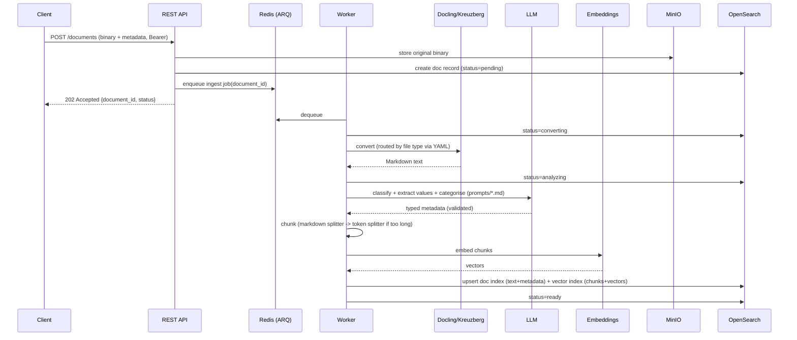

# Architecture

> Status: Draft v1 · Project: **DocStore**
>
> This document describes **how** the functional/non-functional requirements are
> realised. Decisions confirmed with the project owner are marked **[Decision]**.

---

## 1. High-level overview

```mermaid
flowchart LR
    client[API client] -->|Bearer| api[REST API (FastAPI)]
    agent[RAG agent] -->|Bearer / MCP HTTP| mcp[MCP Server]

    api -->|enqueue job| redis[(Redis)]
    worker[Worker (ARQ)] -->|dequeue| redis

    worker -->|convert| docling[Docling service]
    worker -->|convert| kreuzberg[Kreuzberg service]
    worker -->|analyse| llm[(LLM provider\nOllama/OpenAI/Azure)]
    worker -->|embed| emb[(Embedding provider)]

    api --> minio[(MinIO)]
    worker --> minio
    worker --> os[(OpenSearch\ndoc + vector index)]

    api --> os
    mcp --> os
    mcp --> emb
```

### Components

| Component | Tech | Responsibility |
|-----------|------|----------------|
| **REST API** | FastAPI + Uvicorn | Document CRUD, status, tree browsing, backup export, Swagger UI. |
| **MCP server** | Python MCP SDK (Streamable HTTP) **[Decision]** | Hybrid search + tree tools for agents. Separate container. |
| **Worker** | ARQ + Redis **[Decision]** | Durable async pipeline: convert → analyse → chunk → embed → index. |
| **Docling service** | Official `docling-serve` container | Converts PDFs (default) to Markdown, incl. OCR/layout. |
| **Kreuzberg service** | Official Kreuzberg API container | Converts all non-PDF formats + image/scanned OCR to text/Markdown. |
| **OpenSearch** | OpenSearch + Dashboards | Document index (keyword) + vector index (kNN). Hybrid search pipeline. |
| **MinIO** | MinIO | Binary object storage for originals. |
| **Redis** | Redis | ARQ job queue + result/status backend. |
| **LLM/Embeddings** | Ollama (default) / OpenAI / Azure **[Decision]** | Classification, value extraction, categorisation, embeddings. |

---

## 2. Ingestion pipeline



### Converter routing **[Decision: PDF→Docling, else→Kreuzberg]**
Routing is a YAML map of MIME type / extension → service. Resolution order:
explicit extension → MIME type → fallback (`default`). See `config/converters.yaml`.

### Chunking
1. **Markdown-aware splitter** preserves heading/section boundaries.
2. If a resulting chunk exceeds `chunking.max_tokens`, apply **token-based splitting**
   with configurable overlap.
3. `chunking.max_tokens` (and overlap) are **configurable**.

---

## 3. Data model (OpenSearch)

### 3.1 Document index (`documents`)
Keyword/metadata-optimised. One record per document.

| Field | Type | Notes |
|-------|------|-------|
| `document_id` | keyword | UUID, primary key. |
| `title` | text + keyword | filename / derived title. |
| `content_markdown` | text | full converted Markdown (BM25 keyword search). |
| `doc_type` | keyword | classification label (FR-14). |
| `extracted_values` | nested | `{key, type, value, normalized}` (FR-15). |
| `folder_structure` | keyword[] | ordered hierarchical paths (FR-16/17). first = canonical. |
| `category_paths` | keyword[] | normalised tree paths for browsing/filtering. |
| `minio_object` | keyword | bucket/object key of the original binary. |
| `content_hash` | keyword | dedup (FR-13). |
| `mime_type`, `size_bytes` | keyword/long | |
| `status` | keyword | pending/converting/analyzing/indexing/ready/failed. |
| `error` | text | actionable message when failed. |
| `created_at`, `updated_at` | date | |

### 3.2 Vector index (`document_chunks`)
kNN-enabled. One record per chunk.

| Field | Type | Notes |
|-------|------|-------|
| `chunk_id` | keyword | `${document_id}:${ordinal}`. |
| `document_id` | keyword | **reference** to `documents` (FR-25). |
| `snippet` | text | chunk text (returned in results). |
| `ordinal` | integer | position in document. |
| `embedding` | knn_vector(dim) | dimension matches active embedding model (FR-27). |
| `doc_type`, `category_paths` | keyword(/[]) | denormalised for fast filtered search. |

> **Note (NFR/risk):** the `knn_vector` dimension is fixed at index-creation time and
> must match the embedding model. Changing the embedding model requires a reindex.
> This is documented and handled via an index alias + reindex routine.

### 3.3 Referential integrity
Delete document → delete-by-query on `document_chunks` where `document_id` matches,
then delete the doc record and MinIO object (FR-26).

---

## 4. Hybrid search

OpenSearch hybrid search combines BM25 and kNN via a **search pipeline** with a
normalization/combination processor (e.g. weighted arithmetic mean). The MCP
`hybrid_search` tool:

1. Embeds the query (warm embedding session).
2. Issues a single hybrid query (BM25 on `content`/`snippet` + kNN on `embedding`),
   applying metadata filters (doc_type, category path, extracted values).
3. Normalises + combines scores server-side, returns bounded `top_k` snippets with
   document references and scores.

Performance levers (NFR-10/12): warm models, pooled clients, denormalised filter
fields on chunks, bounded `top_k`, and (optional) result caching.

---

## 5. Category tree

`folder_structure` / `category_paths` store materialised paths like
`Insurance/Liability/Private`. A document may have **multiple** paths (FR-16).
The tree is **derived** from these paths (no separate tree store) via an aggregation
query, exposed by both REST (`/categories/tree`, `/categories/{path}/documents`) and
MCP (`get_category_tree`, `list_documents_in_category`).

---

## 6. LLM & embeddings abstraction

A provider interface exposes `chat()`/`complete()` and `embed()`; concrete adapters
implement **Ollama**, **OpenAI**, **Azure OpenAI**. Selection + model names +
endpoints are configured in YAML/env. Structured extraction uses JSON-schema /
function-style outputs validated into Pydantic models (FR-18).

Prompts (classification, value extraction, categorisation) and MCP tool descriptions
are **external Markdown files** under `prompts/`, loaded + rendered at runtime
(NFR-30) — enabling review/versioning without code changes.

---

## 7. Backup/export

- `GET /documents` with `search_after` cursor pagination streams all docs (FR-28).
- `scripts/backup.py` pages through the API and writes, per document, into a
  directory derived from `folder_structure[0]` (FR-30): the original binary, the
  `.md` text, and a `*.metadata.json` sidecar (FR-31).

---

## 8. Security

- Bearer auth dependency on all REST routes (configurable token(s), constant-time
  compare); same for the MCP HTTP endpoint (NFR-18).
- Secrets via env/`.env`; `.env.example` documents them (NFR-19).
- Upload size/content-type validation; pagination caps (NFR-13/20).

---

## 9. Configuration layout

```
config/
  config.yaml        # app: api, mcp, opensearch, minio, redis, logging, security, chunking
  converters.yaml    # file-type -> converter routing (+ service endpoints)
  providers.yaml     # llm + embedding provider selection and model settings
  logging.yaml       # log levels, colour, categories
```
Secrets are referenced as `${ENV_VAR}` and resolved from the environment at load
time (never hard-coded).

---

## 10. Key technology decisions (summary)

| Area | Decision | Rationale |
|------|----------|-----------|
| Web framework | **FastAPI** | async, typed (Pydantic), built-in OpenAPI/Swagger. |
| Async pipeline | **ARQ + Redis** | durable, async-native, lightweight vs. Celery. |
| MCP transport | **Streamable HTTP, own container** | remote agents, scalable. |
| Search store | **OpenSearch** (doc + kNN indices, hybrid pipeline) | required; native hybrid. |
| Object store | **MinIO** | required; S3-compatible. |
| Default providers | **Ollama** (LLM + embeddings) | local, no API keys, OSS-friendly. |
| Converters | **Docling (PDF)**, **Kreuzberg (rest)** | per requirement; official images. |
| Tooling | **uv, ruff, mypy/pyright, pytest** | modern, fast, strict typing. |

---

## 11. Open risks / watch-list

1. **Embedding dimension is fixed per index** → model change needs reindex (mitigated
   via alias + reindex routine).
2. **OCR quality** for scanned docs depends on Docling/Kreuzberg OCR config and
   language packs → expose OCR language settings in config.
3. **LLM extraction reliability** → strict schema validation + confidence flagging +
   re-try; never silently store malformed metadata.
4. **Resource footprint** of the full stack (OpenSearch + Ollama) is significant →
   document minimum hardware; allow pointing at external/managed providers.
5. **Hybrid pipeline setup** requires creating an OpenSearch search pipeline at
   bootstrap → handled by an idempotent bootstrap/migration step.
